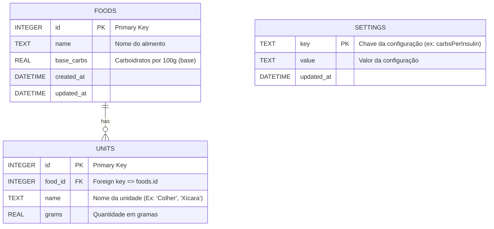
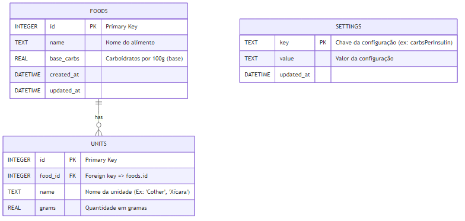

# Banco de Dados — Modelagem (ER Diagram)

Abaixo está o diagrama ER (Mermaid) e uma breve explicação de tabelas, atributos e relacionamentos do banco de dados atual.

---

## Resumo da modelagem
- Foods (tabela `foods`): contém os alimentos cadastrados e seu carboidrato base por 100g.
- Units (tabela `units`): unidades para um alimento específico (relacionamento 1:N com foods). Possui um FK `food_id` com `ON DELETE CASCADE`.
- Settings (tabela `settings`): chave/valor para configurações do app (ex.: `carbsPerInsulin`, `correctionFactor`, `insulinIncrement`).

## Observações
- O serviço `database/foodService.ts` transforma `id` (INTEGER) para `string` no modelo TypeScript e carrega as `units` para cada `food`.
- O `services/settingsService.ts` converte `value` em string para number quando necessário.
- Há índices:
  - `idx_units_food_id` em `units(food_id)`
  - `idx_foods_name` em `foods(name)`

---

## Próximos passos sugeridos
- Adicionar testes unitários para as operações CRUD do `foodService`.
- Implementar transações nas operações `addFood` e `updateFood`.
- Definir esquema de migrações (table `migrations`) para futuras evoluções do banco.
- Considerar a adição de `food_entries` / `glycemia_logs` / `insulin_logs` se desejar armazenar histórico do usuário.

---

Se desejar, posso gerar imagens (PNG / SVG) do diagrama (Mermaid -> PNG) e também criar SQL de migrating/building completo no `docs/db_schema.sql`.

